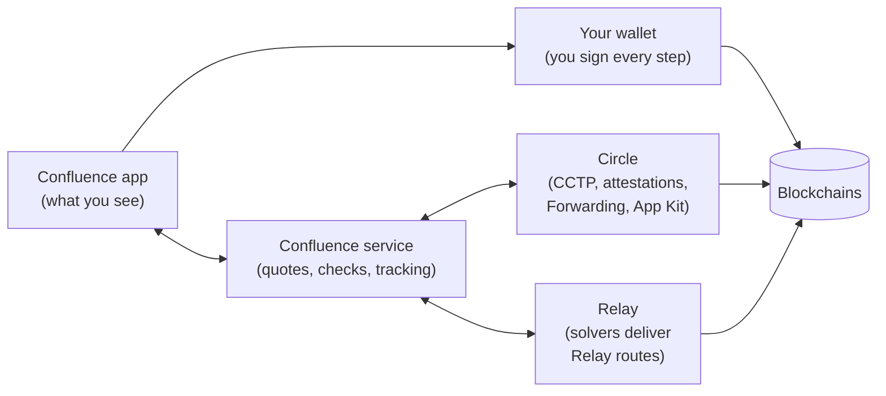
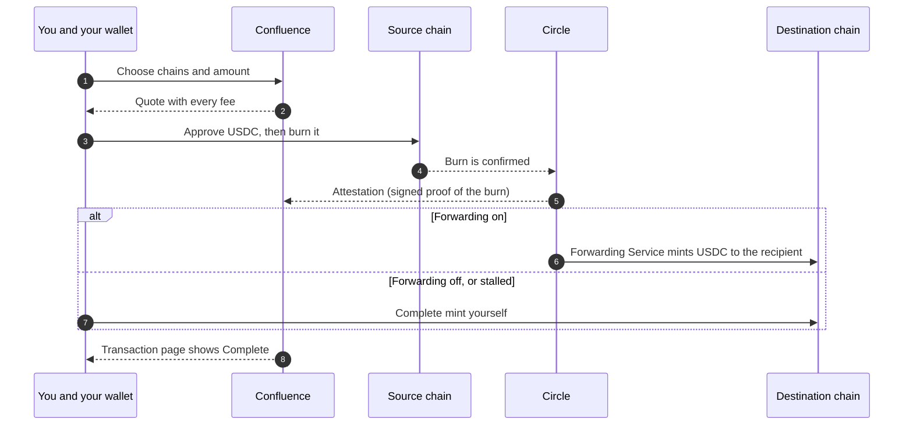
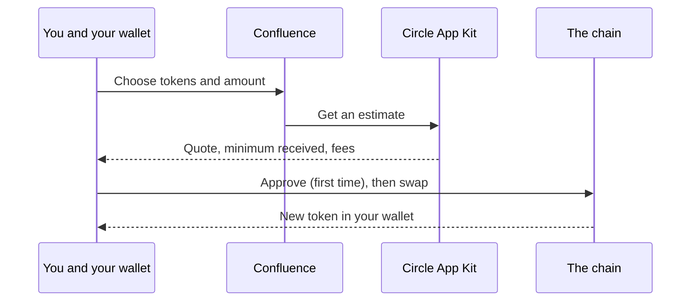
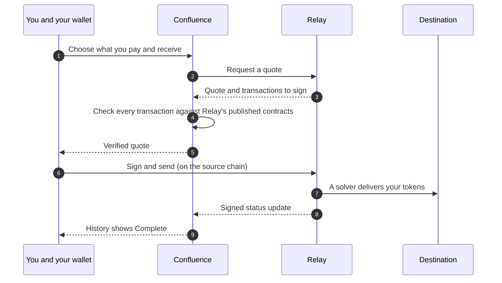

import { Callout } from "nextra/components";

# How Confluence works

Confluence is an interface. Your funds always move between **your wallet** and the protocols that do the actual work: **Circle** for CCTP bridges and App Kit swaps, and **Relay** for Relay routes. Confluence prepares each step, checks it, shows you exactly what will happen, and follows it until it's done.

## The big picture

- **The app** shows quotes and progress, and asks your wallet to sign.
- **The Confluence service** prepares quotes, applies the fee rules, checks Relay quotes before you see them, and tracks every transfer so your history stays up to date.
- **Your wallet** is the only thing that can move your funds. Confluence never holds your keys or your money.

## A CCTP bridge, step by step

The key idea: the destination mint only works with Circle's signed proof that the burn happened, and each burn can only be minted **once**. That's why a bridge can't be duplicated, and why anyone, including you, can safely submit the final mint.

## A swap

## A Relay route

## How status updates reach you

- **Bridges:** the transaction page checks for updates every 10 seconds while it's open, reading Confluence's records and Circle's status directly. Confluence also tracks transfers in the background, so your history is right even if you closed the page.
- **Relay routes:** Relay sends Confluence a signed update each time a route's status changes. As a backup, Confluence also checks unfinished Relay routes with Relay every couple of minutes.

## Principles we build by

- **You stay in control.** Every movement of funds is a transaction you sign.
- **Live, not hard-coded.** Chains and tokens come from Circle and Relay directly, so the app never offers something that stopped working.
- **Keys stay on the server.** Confluence's service keys for Circle and Relay never reach your browser.
- **Verify before you sign.** Quotes are checked before your wallet is asked for anything.

<Callout type="info">
  Your funds don't depend on Confluence staying online. A burned CCTP transfer can always be completed with Circle's attestation, and a Relay
  route is delivered by Relay's own network.
</Callout>
